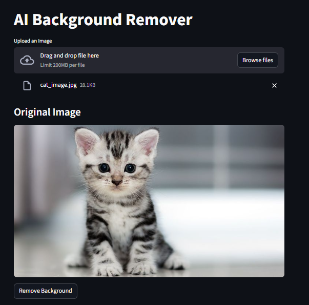
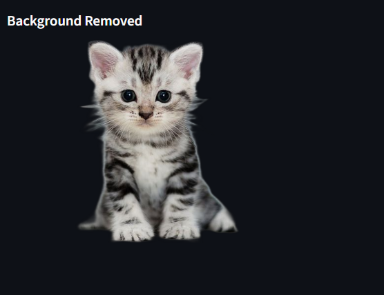

# 🤖 AI Background Remover

A simple AI-powered web application that removes image backgrounds using Python and Streamlit.

---

## 🚀 Features

* Upload any image
* AI removes background automatically
* Easy web interface

---

## 🛠️ Technologies Used

* Python
* Streamlit
* Pillow
* rembg

---

## ▶️ How to Run

Install dependencies:

pip install -r requirements.txt

Run application:

streamlit run remove_background.py

---

## 📷 Demo

  
  

---

## ⭐ Author

Saurabh Pandagale
